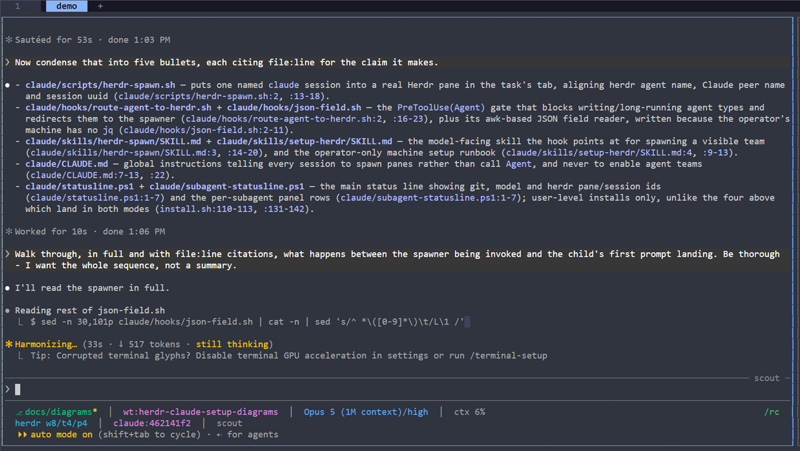

# herdr-claude-setup

Makes Claude Code delegate work to **Herdr panes** instead of in-process subagents, and carries
that setup to any machine.


## The problem

The `Agent` tool's subagents run in-process inside the calling session — no PTY, no child
process, no session id. Herdr recognises agents by inspecting what occupies a pane, so an
in-process subagent is invisible to it and always will be. It never appears in
`herdr agent list`, occupies no pane, and cannot be watched, prompted or interrupted.

So a delegated agent is spawned as a real `claude` process in a real pane instead.

## What one spawn gets you

```bash
bash ~/.claude/scripts/herdr-spawn.sh reviewer --task review-42 \
  --orchestrator <caller's name from ListAgents> --prompt "..."
```


Three identities that already agree:

| Identity | Used for | Set by |
|---|---|---|
| herdr agent name | `herdr agent get/read/prompt/wait reviewer` | `herdr agent start` |
| Claude Code peer name | `SendMessage({to: "reviewer"})` | `claude --name` |
| session uuid | the join key — `herdr agent list` reports it as `agent_session.value` | `claude --session-id` |

Because those are one string rather than three, addressing an agent takes no lookup — and nothing
about it is hierarchical. The `herdr` CLI is on `PATH` in every pane, so **any agent can prompt,
read or wait on any other**, not only the one that spawned it, and not only downwards. A team
assembled this way is a mesh, not a tree.


One tab per task, one pane per agent. Each spawn splits the *largest* pane in the tab, halved
along its longer axis — which is what turns four agents into a grid rather than four stacked
ribbons, and what keeps the fourth one wide enough to read.


A `PreToolUse(Agent)` hook enforces the split: subagent types that write or run long are refused
and pointed here, while cheap read-only ones (`Explore`, `claude-code-guide`) still run
in-process, because a five-second search is not worth a pane, a process start and a teardown.


Outside Herdr (`HERDR_ENV != 1`) the hook stands down and the `Agent` tool behaves normally, so
this is inert on a machine that isn't running Herdr.

## What it looks like


Four agents in one tab, each in its own pane, passing a question along by name. `otto` opens it:

```bash
herdr agent prompt charlie "Charlie - I need the exact line in
  claude/hooks/route-agent-to-herdr.sh where a missing subagent_type is normalised to
  general-purpose. Send your answer straight to dana, not back to me, and ask her to
  check whether install.sh copies that hook in --user mode and to pass her finding to mira."
```

`charlie` answers and hands off. `dana` reports `Baton passed to mira (pane w8:pD)`. `mira` closes
the loop back round — *"Passed to charlie (pane w8:pB), including the manual-merge caveat"* — and
the orchestrator relayed not one hop of it; it sat in the top-left pane saying *"Standing by for
mira's report"*. `dana` then messaged `charlie` again unprompted, which nothing in the brief asked
for and nobody had to authorise.

The other channel reaches the same agents by the same names. Asked to question a sibling and report
back, an agent used one for each leg:

```js
herdr agent prompt hookline "…where is a missing subagent_type normalised…"   // sideways
SendMessage({to: "evidence-kan-32-8b", message: "hookline answered: line 72 …"})  // upwards
```

Up close, the second row of every status line is `statusline.ps1` from this repo, naming the pane
the session occupies and the id that `herdr agent list` reports back as `agent_session.value`:



## Install

Herdr itself must already be installed — the installer checks for it and refuses to guess at a
download source. Everything else is inert without it, so a machine can be prepared first.

### Into one project, beside its existing skills

Adds the spawner, the hook and the `herdr-spawn` skill to `<project>/.claude/`, leaving whatever
is already there untouched.

```bash
cd my-project
npx github:assafcaf/herdr-claude-setup --project .
# or
uvx --from git+https://github.com/assafcaf/herdr-claude-setup herdr-claude-setup --project .
```

It asks where to wire the `Agent` redirect:

| Choice | File | Who gets it |
|---|---|---|
| 1 (default) | `.claude/settings.local.json` | you — gitignored by Claude Code convention |
| 2 | `.claude/settings.json` | everyone on the project, once committed |
| 3 | nothing | files only, wire it later |

Pass `--wire local|shared|none` to skip the question. With no TTY — a script, CI — it does not
prompt: it takes `local`, the option that cannot surprise a teammate.

### Machine-wide

```bash
npx github:assafcaf/herdr-claude-setup --user
```

Installs into `~/.claude` so every project on the machine is covered, and additionally places
`CLAUDE.md`, the status lines and the `setup-herdr` skill — all user-level concerns that a
project install deliberately leaves alone. Finish with:

```bash
herdr integration install claude
```

then merge `settings-fragment.json` into `~/.claude/settings.json` — **merge, never replace**;
that file also holds the machine's theme, permissions and auto-mode settings.

Restart Claude Code either way: hooks and `CLAUDE.md` are read at session start.

Add `--dry-run` to any of the above to see every action without taking one. Re-running is safe;
identical files are skipped and the hook entry is replaced rather than appended twice.

Without Node or Python, `bash install.sh` takes the same flags.

## What lands where

Both modes:

```
scripts/herdr-spawn.sh               the spawner
hooks/route-agent-to-herdr.sh        the PreToolUse(Agent) redirect
hooks/json-field.sh                  its JSON parser — there is no jq on Windows
skills/herdr-spawn/SKILL.md          spawn, drive, tear down
skills/herdr/SKILL.md                generated by `herdr --skill`, not shipped here
```

`--user` additionally:

```
CLAUDE.md                            tells every session to spawn rather than call Agent
skills/setup-herdr/SKILL.md          the full procedure, so /setup-herdr works without a clone
statusline.ps1                       line 2: herdr workspace/tab/pane + session id
subagent-statusline.ps1              one row per visible subagent
herdr/config.toml                    -> Herdr's config dir, only if the machine has none
```

The hook locates its own spawner and skill at runtime, so the same file works at either level
and the message you get names the copy that actually blocked you.

Anything that would be overwritten is backed up to `<file>.bak`, once; identical files are
skipped, so re-running is a no-op.

## What it deliberately will not do

**Install Herdr.** No install source has been verified, so the skill stops and asks rather than
inventing a download URL.

**Rewrite `~/.claude/settings.json`.** An installer that overwrites it silently discards
whatever else the machine had. Unmerged keys are printed instead.

**Copy `herdr-agent-state.ps1`.** That file carries `HERDR_INTEGRATION_ID=claude` and is
overwritten whenever the integration updates — `herdr integration install claude` owns it. A
copy would go stale silently.

**Carry the `autoMode` block.** It is written by `/auto-mode-setup` against the environment it
finds; one machine's is wrong on another.

**Vendor Herdr's own skill.** `herdr --skill` prints the copy that matches the installed binary,
so the installer generates `skills/herdr/SKILL.md` rather than shipping one. It cannot go stale
against a newer Herdr, and this repo redistributes nothing that is not its own.

## Notes

The installer is one bash script. The `npx` and `uvx` entry points are launchers that find a
bash and forward their arguments to it — a second implementation in JavaScript or Python would
drift from the first the moment either changed. On Windows they look for Git Bash specifically,
because a bare `bash` there is often WSL's, which would install into the WSL home rather than
the one Claude Code reads.

Merging into an existing `settings.json` is done by a real JSON parser (`node`, else `python3`),
never by text munging. With neither available the installer prints the entry for you rather than
guessing.

The PowerShell status lines are Windows-only and skipped elsewhere. Everything else is portable.

## Licence

MIT — see [LICENSE](LICENSE).

The generated `skills/herdr/SKILL.md` is Herdr's own documentation, produced on your machine by
`herdr --skill`. It is not covered by this licence and is not distributed here.
